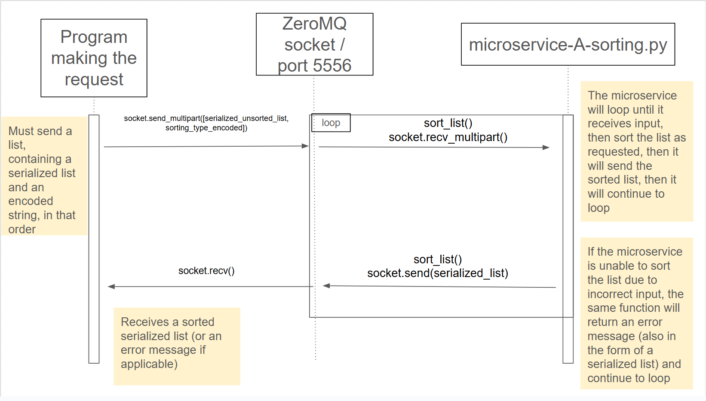

# CS361-microservice-A-sorting
This contains the CS 361 Microservice A created by Lauren for Allison's program. The microservice sorts lists alphabetically, or in ascending or descending order by weight.

# A. To request data from the microservice:

## Setup
This microservice uses zeroMQ to communicate. The program must import zmq and pickle in order to use the microservice. See below for an example of how to do this:
```
import zmq
import pickle
```
To use zeroMQ, the program must also set up the context, the socket, and connect the socket to a port. The microservice uses port 5556, so if it is necessary to change the port it would need to be changed in the microservice as well. See below for an example:
```
context = zmq.Context()
socket = context.socket(zmq.REQ)
socket.connect("tcp://localhost:5556")
```
## Requirements
The microservice will act as the server and must be running in order to receive information from the program. The program requesting data from the microservice will need to send a serialized list and an encoded string. 

### List
The list will need to consist of strings where the first part of the string is the name of a pokemon, then a space, then a number representing the weight of the pokemon. For example: ```unsorted_list = ['Pikachu 2', 'Squirtle 3', 'Clefairy 1']```.  

After the list is formatted correctly as directed above, it will need to be serialized before it is sent to the microservice, which can be done using pickle.dumps(), like this:
```
serialized_unsorted_list = pickle.dumps(unsorted_list) 
```
### String
The string will need to be one of the following options based on how the user wants the list to be sorted: ```sorting_type = 'A'``` for alphabetical, ```sorting_type = 'WI'``` for weight increasing order, or ```sorting_type = 'WD'``` for weight decreasing order. 

The string will need to be encoded before it can be sent to the microservice, which can be done like this:
```
sorting_type_encoded = sorting_type.encode()
```
## Sending the request to the microservice
The serialized list and the encoded string can be sent to the microservice using socket.send_multipart(), like this:
```
socket.send_multipart([serialized_unsorted_list, sorting_type_encoded])
```

# B. To receive data from the microservice:
After the request is made and the microservice sorts the list, the microservice will send the sorted list back, serialized. To receive the list, the program should use socket.recv() and assign the received list to a variable, like this:
```
sorted_list_serialized = socket.recv()
```
In order to return the list to a useable and readable format, it will need to be deserialized using pickle.loads(), like this:
```
deserialized_sorted_list = pickle.loads(sorted_list_serialized)
```

# UML sequence diagram:

